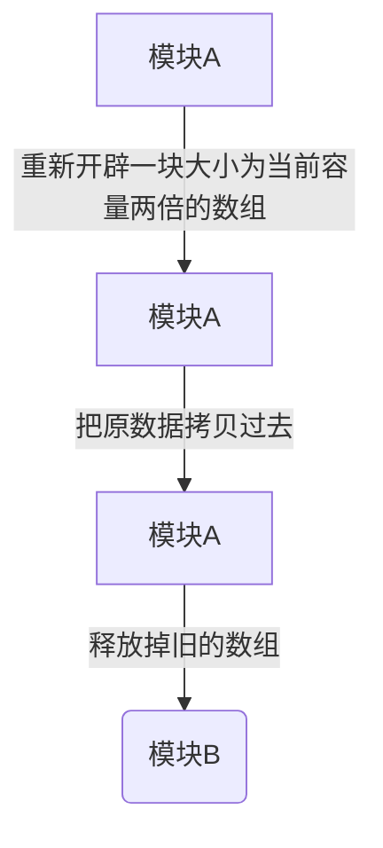

```objective-c
NSArray *arr = @[@1, @2, @3];
NSMutableArray *muArr = [NSMutableArray arrayWithArray:arr];

// for in 移除数据会崩溃，循环次数一定，但是删除数据后会导致越界
//    for (NSNumber *num in muArr) {
//        if (num.integerValue == 2) {
//            [muArr removeObject:num];
//        }
//    }

for (int i = 0; i < muArr.count - 1; i ++) { // muArr.count 也在随时变
	NSNumber *num = muArr[i];
	if (num.integerValue == 2) {
		[muArr removeObject:num];
	}
}

// block 内部可以修改可变数组的元素，而不用__blok
[muArr enumerateObjectsUsingBlock:^(id  _Nonnull obj, NSUInteger idx, BOOL * _Nonnull stop) {
	if ([obj integerValue] == 2) {
		[muArr removeObject:obj];
	}
}];

// 对于集合中对象数很多的情况下，for in 的遍历速度非常之快，但小规模的遍历并不明显（还没普通for循环快）
// Value查询index的时候, 面对大量的数组推荐使用 enumerateObjectsWithOptions的并行方法.
```


##### 数组线程安全的思考
NSMutableArray是线程不安全的，当有多个线程同时对数组进行操作的时候可能导致崩溃或数据错误
用`dispatch_sync`读
`dispatch_barrier_async`写

##### 问题
数组和字典属于类族，最好不要继承

在 Cocoa 中有一种奇葩的类存在 Class Clusters。面向对象的编程告诉我们：“类可以继承，子类具有父类的方法”。而 Cocoa 中的 Class Clusters 虽然平时表现的像普通类一样，但子类却没法继承父类的方法。 NSMutableArray就是这样的存在。为什么会这样呢？因为 Class Clusters 内部其实是由多个私有的类和方法组成。例如，NSNumber 其实也是这种类，这样一个类可以把各种不同的原始类型封装到一个类下面，提供统一的接口。这正设计模式中的抽象工厂模式。

查看Apple的文档，要继承这样的类需要必须实现其primitive methods方法，实现了这些方法，其它方法便都能通过这些方法组合而成。比如

需要继承NSMutableArray就需要实现它的以下primitive methods：
```
- (void)addObject:(id)anObject;
- (void)insertObject:(id)anObject atIndex:(NSUInteger)index;
- (void)removeLastObject;
- (void)removeObjectAtIndex:(NSUInteger)index;
- (void)replaceObjectAtIndex:(NSUInteger)index withObject:(id)anObject;
```
NSArray的primitive methods：
```
- (NSUInteger)count;
- (id)objectAtIndex:(NSUInteger)index;
```


##### 原理
动态数组并不是真正意义上的动态的内存，而是一块连续的内存，当添加新的元素时，容量已经等于当前的大小的时候(存不下了)，执行下面3步


- 古老的C数组:
优点:查询速度很快，直接通过下表找到对应的值
缺点:修改、删除数据很慢，需要移动基于所有的其他的元素


- NSMutableArray

offset: 有效数据起始位置偏移量
size: 实际占用的内存大小
used: 数组的实际的有效数据个数
*list: 实际内存的起始地址

**删除元素**
[arr removeObjecAtIndex:0];
仅仅修改 offset即可，内存完全不需要移动。

**插入元素**
[arr insertObjec:@"test"atIndex:0];
如果buff的size还够用，不需要扩展buff，数据会在buff的末端添加进去，此时offset由0变成size-1,used+1.over
循环buff的牛逼之处就在于此，无需移动内存，实现插入元素。

**删除元素**
[arr removeObjecAtIndex:3];
删除头尾元素直接修改offset或者used即可
但是如果删除中间元素，就避免不了移动其他元素，不过NSArray会选择更少移动的那一边移动数据。
所以我们在实际使用过程中应该尽量避免这么做。


https://www.jianshu.com/p/0b5a97720ebe
