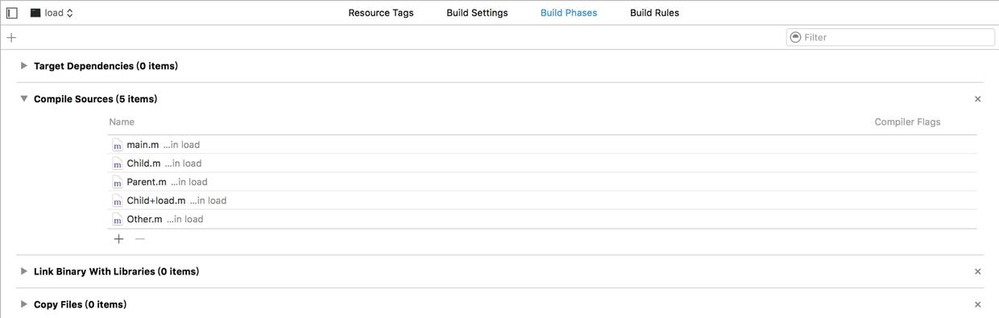
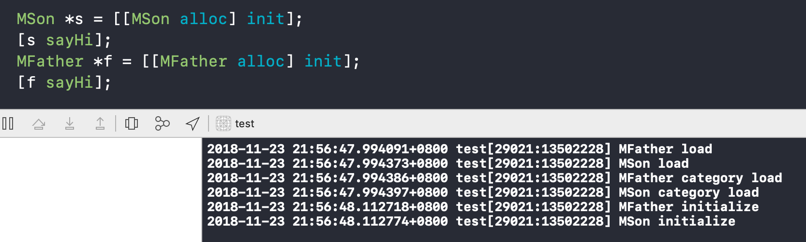

- `+load` 会在程序加载时调用，
- `+initialize` 会在第一次调用类的类方法或实例方法之前被调用。

##### load



`+load`方法在这个文件被程序装载时调用。只要是在`Compile Sources`中出现的文件总是会被装载，这与这个类是否被用到无关，因此`+load`方法总是在`main`函数之前调用。

由于调用`load`方法时的环境很不安全，我们应该尽量减少`load`方法的逻辑。另一个原因是`load`方法是线程安全的，它内部使用了锁，所以我们应该避免线程阻塞在`load`方法中。
一个常见的使用场景是在`load`方法中实现`Method Swizzle：`

##### initialize

`initialize`自动调用父类的`initialize`。即使子类没有实现`initialize`方法，也会调用父类的方法，这会导致一个很严重的问题：

```
// In Parent.m
+ (void)initialize {
    NSLog(@"Initialize Parent, caller Class %@", [self class]);
}

// In Child.m
// 注释掉initialize方法

// In main.m
Child *child = [Child new];
```
运行后发现父类的`initialize`方法竟然调用了两次：
这是因为在创建子类对象时，首先要创建父类对象，所以会调用一次父类的`initialize`方法，然后创建子类时，尽管自己没有实现`initialize`方法，但还是会调用到父类的方法。
虽然`initialize`方法对一个类而言只会调用一次，但这里由于出现了两个类，所以调用两次符合规则，但不符合我们的需求。正确使用`initialize`方法的姿势如下：
```
// In Parent.m
+ (void)initialize {
    if (self == [Parent class]) {
        NSLog(@"Initialize Parent, caller Class %@", [self class]);
    }
}
```
加上判断后，就不会因为子类而调用到自己的`initialize`方法了。

##### 总结

load和initialize方法内部使用了锁，因此它们是线程安全的。

load -> main() -> initialize


| 方法 | 首次调用 | category装载顺序  | 调用父类 |
| ---- | -------- | ---------- |---|
| load | 加载即调用，main函数之前 | 有关 | 子类不实现，不调用父类 |
| initialize | 首次使用调用，main函数之后 | 无关 | 子类不实现同样会调用父类，导致父类调用两次 |




